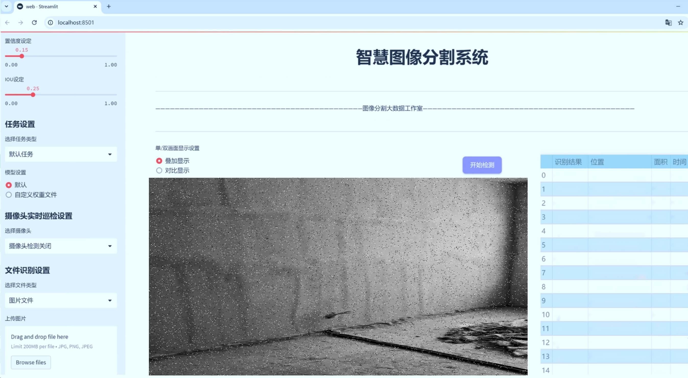
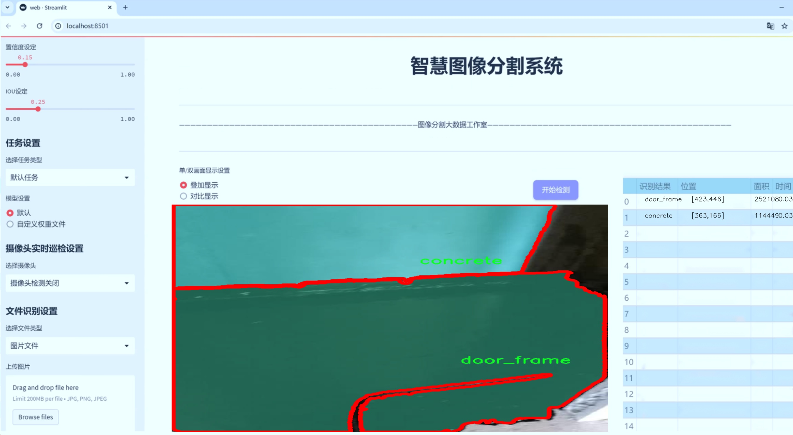
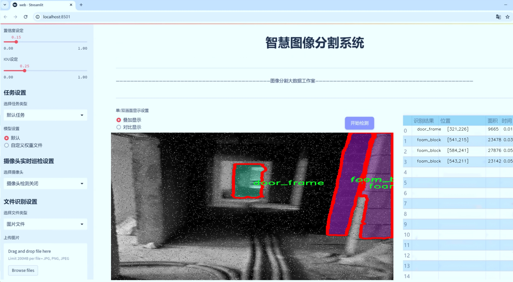
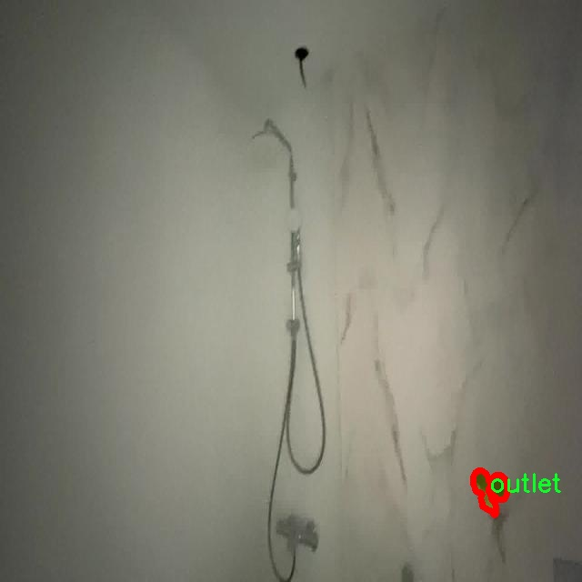
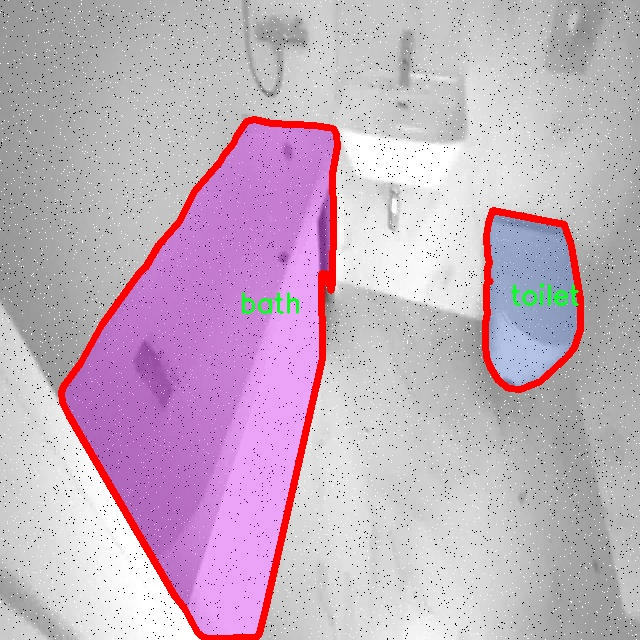
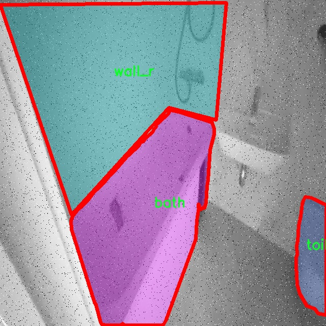
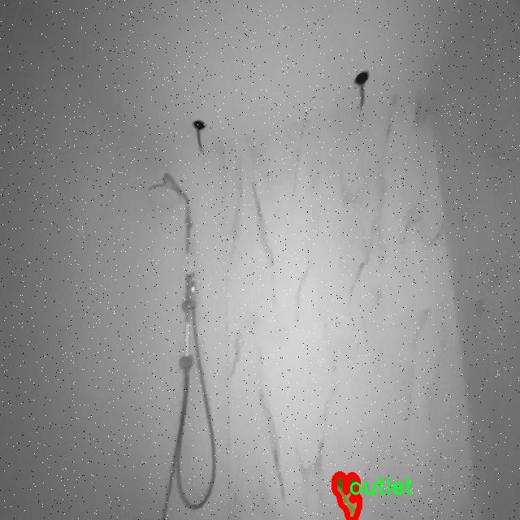
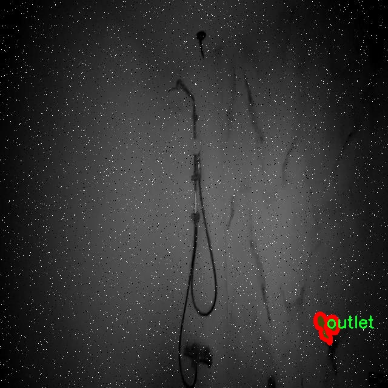

# 室内物品墙体脱落分割系统源码＆数据集分享
 [yolov8-seg-dyhead-DCNV3＆yolov8-seg-AFPN-P345等50+全套改进创新点发刊_一键训练教程_Web前端展示]

### 1.研究背景与意义

项目参考[ILSVRC ImageNet Large Scale Visual Recognition Challenge](https://gitee.com/YOLOv8_YOLOv11_Segmentation_Studio/projects)

项目来源[AAAI Global Al lnnovation Contest](https://kdocs.cn/l/cszuIiCKVNis)

研究背景与意义

随着城市化进程的加快，室内环境的复杂性和多样性日益增加，室内物品的识别与分割成为计算机视觉领域的重要研究方向。尤其是在建筑物的维护与管理中，能够准确识别和分割室内物品，不仅可以提高工作效率，还能有效降低人力成本，提升安全性。近年来，深度学习技术的迅猛发展为物体检测与分割提供了强有力的工具，YOLO（You Only Look Once）系列模型因其高效性和实时性被广泛应用于各类物体检测任务中。YOLOv8作为该系列的最新版本，结合了更为先进的特征提取和处理机制，具有更高的准确性和更快的推理速度，成为室内物品识别与分割的理想选择。

本研究旨在基于改进的YOLOv8模型，构建一个高效的室内物品墙体脱落分割系统。该系统将针对建筑物内部的17类物品进行精确的实例分割，包括浴室、天花板、混凝土、门框、门、排水口、地板、泡沫块、垃圾、厨房、复合材料、插座、散热器、瓷砖、厕所、墙体和窗户等。这些物品在室内环境中扮演着重要角色，其准确识别和分割对于后续的室内环境分析、空间利用优化及智能家居系统的构建具有重要意义。

在数据集方面，本研究使用了包含2400张图像的“Building_segment”数据集，涵盖了多种室内物品的多样性和复杂性。通过对这些图像的深入分析与处理，能够为模型的训练提供丰富的样本，从而提升模型的泛化能力和准确性。此外，数据集中17类物品的多样性也为模型的多任务学习提供了良好的基础，使得模型能够在处理不同物品时表现出更好的适应性。

本研究的意义不仅在于提升室内物品的识别与分割精度，更在于推动智能建筑和智能家居技术的发展。通过实现高效的室内物品分割，能够为室内环境的智能监控、自动化管理提供基础数据支持，从而实现更为智能化的生活和工作环境。同时，基于YOLOv8的改进模型也为后续的研究提供了新的思路和方法，促进了计算机视觉技术在实际应用中的推广与应用。

综上所述，基于改进YOLOv8的室内物品墙体脱落分割系统的研究，不仅具有重要的理论价值，还具备广泛的应用前景。通过本研究的开展，期望能够为室内物品的智能识别与管理提供有效的解决方案，推动相关领域的进一步发展。

### 2.图片演示







##### 注意：由于此博客编辑较早，上面“2.图片演示”和“3.视频演示”展示的系统图片或者视频可能为老版本，新版本在老版本的基础上升级如下：（实际效果以升级的新版本为准）

  （1）适配了YOLOV8的“目标检测”模型和“实例分割”模型，通过加载相应的权重（.pt）文件即可自适应加载模型。

  （2）支持“图片识别”、“视频识别”、“摄像头实时识别”三种识别模式。

  （3）支持“图片识别”、“视频识别”、“摄像头实时识别”三种识别结果保存导出，解决手动导出（容易卡顿出现爆内存）存在的问题，识别完自动保存结果并导出到tempDir中。

  （4）支持Web前端系统中的标题、背景图等自定义修改，后面提供修改教程。

  另外本项目提供训练的数据集和训练教程,暂不提供权重文件（best.pt）,需要您按照教程进行训练后实现图片演示和Web前端界面演示的效果。

### 3.视频演示

[3.1 视频演示](https://www.bilibili.com/video/BV1vK2HYGE96/)

### 4.数据集信息展示

##### 4.1 本项目数据集详细数据（类别数＆类别名）

nc: 17
names: ['bath', 'ceiling_r', 'concrete', 'door_frame', 'door_r', 'drain', 'floor_no', 'foam_block', 'garbage', 'kitchen', 'laminate', 'outlet', 'radiator', 'tiles', 'toilet', 'wall_r', 'win']


##### 4.2 本项目数据集信息介绍

数据集信息展示

在本研究中，我们使用了名为“Building_segment”的数据集，以支持改进YOLOv8-seg的室内物品墙体脱落分割系统的训练与评估。该数据集专门设计用于室内环境的物体分割任务，涵盖了多种建筑元素和室内物品，具有17个不同的类别。这些类别包括：浴室（bath）、天花板（ceiling_r）、混凝土（concrete）、门框（door_frame）、门（door_r）、排水管（drain）、地板（floor_no）、泡沫块（foam_block）、垃圾（garbage）、厨房（kitchen）、层压板（laminate）、插座（outlet）、散热器（radiator）、瓷砖（tiles）、厕所（toilet）、墙壁（wall_r）和窗户（win）。每个类别都代表了室内环境中常见的物体或结构，为我们在进行墙体脱落检测时提供了丰富的上下文信息。

“Building_segment”数据集的设计理念是通过多样化的样本和详细的标注，帮助模型更好地理解和分割室内环境中的不同元素。数据集中包含的类别不仅涵盖了基础的建筑构件，如墙壁、地板和天花板，还包括了各种家具和设备，如厨房用具、散热器和插座。这种多样性使得模型在训练过程中能够学习到不同物体的特征和相互关系，从而提高其在实际应用中的表现。

数据集的标注采用了精细的分割方式，每个类别的物体都被准确地标记，确保了训练数据的高质量。这对于深度学习模型的训练至关重要，因为高质量的标注能够显著提高模型的学习效率和最终的分割精度。此外，数据集中的样本涵盖了不同的室内场景和布局，提供了丰富的变异性，使得模型能够更好地适应各种实际环境中的挑战。

在训练过程中，我们将利用“Building_segment”数据集中的多样化样本，通过数据增强技术进一步扩展训练数据的多样性。这包括旋转、缩放、裁剪等操作，以提高模型的鲁棒性和泛化能力。通过这些方法，我们期望模型能够在面对未见过的室内环境时，依然能够保持较高的分割精度。

总之，“Building_segment”数据集为改进YOLOv8-seg的室内物品墙体脱落分割系统提供了坚实的基础。其丰富的类别和高质量的标注，不仅有助于模型的训练与优化，还为后续的应用研究奠定了良好的数据基础。通过对该数据集的深入分析和利用，我们期望能够实现更高效、更准确的室内物品分割，为相关领域的研究和应用提供有力支持。











### 5.全套项目环境部署视频教程（零基础手把手教学）

[5.1 环境部署教程链接（零基础手把手教学）](https://www.bilibili.com/video/BV1jG4Ve4E9t/?vd_source=bc9aec86d164b67a7004b996143742dc)


[5.2 安装Python虚拟环境创建和依赖库安装视频教程链接（零基础手把手教学）](https://www.bilibili.com/video/BV1nA4VeYEze/?vd_source=bc9aec86d164b67a7004b996143742dc)

### 6.手把手YOLOV8-seg训练视频教程（零基础小白有手就能学会）

[6.1 手把手YOLOV8-seg训练视频教程（零基础小白有手就能学会）](https://www.bilibili.com/video/BV1cA4VeYETe/?vd_source=bc9aec86d164b67a7004b996143742dc)


按照上面的训练视频教程链接加载项目提供的数据集，运行train.py即可开始训练



     Epoch   gpu_mem       box       obj       cls    labels  img_size
     1/200     0G   0.01576   0.01955  0.007536        22      1280: 100%|██████████| 849/849 [14:42<00:00,  1.04s/it]
               Class     Images     Labels          P          R     mAP@.5 mAP@.5:.95: 100%|██████████| 213/213 [01:14<00:00,  2.87it/s]
                 all       3395      17314      0.994      0.957      0.0957      0.0843

     Epoch   gpu_mem       box       obj       cls    labels  img_size
     2/200     0G   0.01578   0.01923  0.007006        22      1280: 100%|██████████| 849/849 [14:44<00:00,  1.04s/it]
               Class     Images     Labels          P          R     mAP@.5 mAP@.5:.95: 100%|██████████| 213/213 [01:12<00:00,  2.95it/s]
                 all       3395      17314      0.996      0.956      0.0957      0.0845

     Epoch   gpu_mem       box       obj       cls    labels  img_size
     3/200     0G   0.01561    0.0191  0.006895        27      1280: 100%|██████████| 849/849 [10:56<00:00,  1.29it/s]
               Class     Images     Labels          P          R     mAP@.5 mAP@.5:.95: 100%|███████   | 187/213 [00:52<00:00,  4.04it/s]
                 all       3395      17314      0.996      0.957      0.0957      0.0845


### 7.50+种全套YOLOV8-seg创新点代码加载调参视频教程（一键加载写好的改进模型的配置文件）

[7.1 50+种全套YOLOV8-seg创新点代码加载调参视频教程（一键加载写好的改进模型的配置文件）](https://www.bilibili.com/video/BV1Hw4VePEXv/?vd_source=bc9aec86d164b67a7004b996143742dc)

### 8.YOLOV8-seg图像分割算法原理

原始YOLOV8-seg算法原理

YOLOV8-seg算法是YOLO系列中的一个重要进展，旨在提升目标检测和分割任务的性能。与以往的YOLO版本相比，YOLOV8-seg采用了anchor-free的方法，这一创新显著提高了检测精度和速度，尤其是在复杂环境下的表现。该算法的核心思想是通过优化网络结构和引入新的特征提取机制，以便更好地处理小目标和复杂背景下的目标检测任务。

YOLOV8-seg的网络结构主要由四个模块组成：输入端、主干网络、Neck端和输出端。输入端负责对输入图像进行预处理，包括Mosaic数据增强、自适应图片缩放和灰度填充等操作。这些预处理步骤旨在提高模型对不同输入条件的适应能力，从而为后续的特征提取打下良好的基础。主干网络则采用了卷积、池化等技术，通过C2f模块和SPPF结构提取图像特征。C2f模块的引入使得特征提取过程更加高效，能够保留更多的上下文信息，这对于小目标的检测尤为重要。

在Neck端，YOLOV8-seg利用了路径聚合网络（PAN）结构，通过上采样和下采样的方式融合不同尺度的特征图。这一设计使得网络能够更好地捕捉到不同尺度目标的特征信息，从而提高了检测的准确性。输出端则采用了解耦头结构，将分类和回归过程分开进行，这样不仅加速了模型的收敛速度，还提高了模型的整体性能。

尽管YOLOV8-seg在许多方面表现出色，但在复杂水面环境下仍然面临一些挑战。小目标漂浮物的特征复杂，背景多样，导致了定位误差和对目标感知能力不足的问题。为了解决这些问题，YOLOV8-seg在原有的基础上进行了多项改进。首先，引入了BiFormer双层路由注意力机制，构建了C2fBF模块，以减轻主干网络下采样过程中的噪声影响。这一机制通过捕获远程依赖关系，能够保留更细粒度的上下文信息，从而提升模型对小目标的感知能力。

此外，为了进一步提升对小目标的检测能力，YOLOV8-seg添加了一个更小的检测头。这一小型检测头的设计旨在增强网络对小目标的感知力，使得模型在处理复杂背景时能够更准确地识别出小目标。与此同时，在Neck端引入了GSConv和Slim-neck技术，这不仅保持了模型的检测精度，还有效降低了计算量，使得YOLOV8-seg在资源受限的环境中也能高效运行。

在损失函数的选择上，YOLOV8-seg采用了MPDIoU损失函数替代了传统的CIoU损失函数。这一改进旨在提高模型的泛化能力和精准度，使得YOLOV8-seg在不同数据集和应用场景下都能保持良好的性能。MPDIoU损失函数通过综合考虑目标的重叠程度和中心点距离，能够更准确地指导模型进行优化，从而提升检测效果。

综上所述，YOLOV8-seg算法通过引入多项创新技术和改进措施，成功提升了目标检测和分割的性能。其核心在于高效的特征提取机制、灵活的特征融合策略以及精准的损失函数设计。这些改进使得YOLOV8-seg在复杂环境下的目标检测任务中表现出色，尤其是在处理小目标和复杂背景时，展现了更强的鲁棒性和准确性。未来，随着算法的不断优化和应用场景的扩展，YOLOV8-seg有望在更多领域中发挥重要作用，推动目标检测技术的进一步发展。


### 9.系统功能展示（检测对象为举例，实际内容以本项目数据集为准）

图9.1.系统支持检测结果表格显示

  图9.2.系统支持置信度和IOU阈值手动调节

  图9.3.系统支持自定义加载权重文件best.pt(需要你通过步骤5中训练获得)

  图9.4.系统支持摄像头实时识别

  图9.5.系统支持图片识别

  图9.6.系统支持视频识别

  图9.7.系统支持识别结果文件自动保存

  图9.8.系统支持Excel导出检测结果数据


### 10.50+种全套YOLOV8-seg创新点原理讲解（非科班也可以轻松写刊发刊，V11版本正在科研待更新）

#### 10.1 由于篇幅限制，每个创新点的具体原理讲解就不一一展开，具体见下列网址中的创新点对应子项目的技术原理博客网址【Blog】：


[10.1 50+种全套YOLOV8-seg创新点原理讲解链接](https://gitee.com/qunmasj/good)

#### 10.2 部分改进模块原理讲解(完整的改进原理见上图和技术博客链接)【此小节的图要是加载失败请移步原始博客查看，链接：https://blog.csdn.net/cheng2333333?type=blog】
### YOLOv8简介
YOLO（You Only Look Once）是一种流行的对象检测和图像分割模型，由华盛顿大学的Joseph Redmon和Ali Farhadi开发。YOLO于2015年推出，以其高速度和高精度迅速走红。

YOLOv2于2016年发布，通过合并批处理规范化、锚盒和维度集群来改进原始模型
2018年推出的YOLOv3使用更高效的骨干网络、多个锚点和空间金字塔池进一步增强了该模型的性能
YOLOv4于2020年发布，引入了Mosaic数据增强、新的无锚检测头和新的丢失功能等创新
YOLOv5进一步提高了模型的性能，并添加了超参数优化、集成实验跟踪和自动导出到流行导出格式等新功能
YOLOv6于2022年由美团开源，目前正在该公司的许多自动配送机器人中使用
YOLOv7在COCO关键点数据集上添加了额外的任务，如姿态估计
YOLOv8是Ultralytics公司推出的YOLO的最新版本。作为一款尖端、最先进的（SOTA）车型，YOLOv8在之前版本的成功基础上，引入了新的功能和改进，以增强性能、灵活性和效率。YOLOv8支持全方位的视觉AI任务，包括检测、分割、姿态估计、跟踪和分类。这种多功能性允许用户在不同的应用程序和域中利用YOLOv8的功能
#### YOLOv8的新特性与可用模型

Ultralytics 并没有直接将开源库命名为 YOLOv8，而是直接使用 ultralytics 这个词，原因是 ultralytics 将这个库定位为算法框架，而非某一个特定算法，一个主要特点是可扩展性。其希望这个库不仅仅能够用于 YOLO 系列模型，而是能够支持非 YOLO 模型以及分类分割姿态估计等各类任务。总而言之，ultralytics 开源库的两个主要优点是：

融合众多当前 SOTA 技术于一体
未来将支持其他 YOLO 系列以及 YOLO 之外的更多算法
Ultralytics为YOLO模型发布了一个全新的存储库。它被构建为 用于训练对象检测、实例分割和图像分类模型的统一框架。

提供了一个全新的 SOTA 模型，包括 P5 640 和 P6 1280 分辨率的目标检测网络和基于 YOLACT 的实例分割模型。和 YOLOv5 一样，基于缩放系数也提供了 N/S/M/L/X 尺度的不同大小模型，用于满足不同场景需求
骨干网络和 Neck 部分可能参考了 YOLOv7 ELAN 设计思想，将 YOLOv5 的 C3 结构换成了梯度流更丰富的 C2f 结构，并对不同尺度模型调整了不同的通道数，属于对模型结构精心微调，不再是无脑一套参数应用所有模型，大幅提升了模型性能。不过这个 C2f 模块中存在 Split 等操作对特定硬件部署没有之前那么友好了
Head 部分相比 YOLOv5 改动较大，换成了目前主流的解耦头结构，将分类和检测头分离，同时也从 Anchor-Based 换成了 Anchor-Free
Loss 计算方面采用了 TaskAlignedAssigner 正样本分配策略，并引入了 Distribution Focal Loss
训练的数据增强部分引入了 YOLOX 中的最后 10 epoch 关闭 Mosiac 增强的操作，可以有效地提升精度
YOLOv8 还高效灵活地支持多种导出格式，并且该模型可以在 CPU 和 GPU 上运行。YOLOv8 模型的每个类别中有五个模型用于检测、分割和分类。YOLOv8 Nano 是最快和最小的，而 YOLOv8 Extra Large (YOLOv8x) 是其中最准确但最慢的。


### FocalModulation模型的基本原理
参考该博客，Focal Modulation Networks（FocalNets）的基本原理是替换自注意力（Self-Attention）模块，使用焦点调制（focal modulation）机制来捕捉图像中的长距离依赖和上下文信息。下图是自注意力和焦点调制两种方法的对比。


自注意力要求对每个查询令牌（Query Token）与其他令牌进行复杂的查询-键（Query-Key）交互和查询-值（Query-Value）聚合，以计算注意力分数并捕捉上下文。而焦点调制则先将空间上下文以不同粒度聚合到调制器中，然后以查询依赖的方式将这些调制器注入到查询令牌中。焦点调制简化了交互和聚合操作，使其更轻量级。在图中，自注意力部分使用红色虚线表示查询-键交互和黄色虚线表示查询-值聚合，而焦点调制部分则用蓝色表示调制器聚合和黄色表示查询-调制器交互。 

FocalModulation模型通过以下步骤实现：

1. 焦点上下文化：用深度卷积层堆叠来编码不同范围的视觉上下文。


2. 门控聚合：通过门控机制，选择性地将上下文信息聚合到每个查询令牌的调制器中。


3. 逐元素仿射变换：将聚合后的调制器通过仿射变换注入到每个查询令牌中。

下面来分别介绍这三个机制->

#### 焦点上下文化
焦点上下文化（Focal Contextualization）是焦点调制（Focal Modulation）的一个组成部分。焦点上下文化使用一系列深度卷积层（depth-wise convolutional layers）来编码不同范围内的视觉上下文信息。这些层可以捕捉从近处到远处的视觉特征，从而允许网络在不同层次上理解图像内容。通过这种方式，网络能够在聚合上下文信息时保持对局部细节的敏感性，并增强对全局结构的认识。


​

这张图详细比较了自注意力（Self-Attention, SA）和焦点调制（Focal Modulation）的机制，并特别展示了焦点调制中的上下文聚合过程。左侧的图展示了自注意力模型如何通过键（k）和查询（q）之间的交互，以及随后的聚合来生成输出。而中间和右侧的图说明了焦点调制如何通过层级化的上下文聚合和门控聚合过程替代自注意力模型的这一过程。在焦点调制中，输入首先通过轻量级线性层进行处理，然后通过层级化的上下文化模块和门控机制来选择性地聚合信息，最终通过调制器与查询（q）进行交互以生成输出。

#### 门控聚合
在Focal Modulation Networks（FocalNets）中的 "门控聚合"（Gated Aggregation）是关键组件之一，这一过程涉及使用门控机制来选择性地聚合上下文信息。以下是这个过程的详细分析：

1. 什么是门控机制？
门控机制在深度学习中常用于控制信息流。它通常用于决定哪些信息应该被传递，哪些应该被阻断。在循环神经网络（RNN）中，特别是在长短期记忆网络（LSTM）和门控循环单元（GRU）中，门控机制用于调节信息在时间序列数据中的流动。

2. 门控聚合的目的
在FocalNets中，门控聚合的目的是为每个查询令牌（即处理中的数据单元）选择性地聚合上下文信息。这意味着网络能够决定哪些特定的上下文信息对于当前处理的查询令牌是重要的，从而专注于那些最相关的信息。

3. 如何实现门控聚合？
实现门控聚合可能涉及一系列计算步骤，其中包括：

计算上下文信息：这可能涉及使用深度卷积层（如文中提到的）对输入图像的不同区域进行编码，以捕捉从局部到全局的视觉上下文。
门控操作：这一步骤涉及到一个决策过程，根据当前查询令牌的特征来决定哪些上下文信息是相关的。这可能通过一个学习到的权重（门）来实现，该权重决定了不同上下文信息的重要性。
信息聚合：最后，根据门控操作的结果，选择性地聚合上下文信息到一个调制器中。这个调制器随后被用于调整或“调制”查询令牌的表示。
4. 门控聚合的好处
通过门控聚合，FocalNets能够更有效地聚焦于对当前任务最关键的信息。这种方法提高了模型的效率和性能，因为它减少了不必要信息的处理，同时增强了对关键特征的关注。在视觉任务中，这可能意味着更好的目标检测和图像分类性能，特别是在复杂或多变的视觉环境中。

总结：门控聚合是FocalNets的一个核心组成部分，它通过选择性地集中处理重要的上下文信息来提升网络的效率和性能。

#### 逐元素仿射变换
在Focal Modulation Networks（FocalNets）中的第三个关键组件是逐元素仿射变换，这个步骤涉及将通过门控聚合得到的调制器注入到每个查询令牌中。以下是该过程的详细分析：

1. 仿射变换的基本概念：
仿射变换是一种线性变换，用于对数据进行缩放、旋转、平移和倾斜等操作。在深度学习中，逐元素的仿射变换通常指的是对每个元素进行线性变换，这种变换可以被描述为y = ax + b，其中x是输入，y是输出，a和b是变换的参数。

2. 逐元素仿射变换的作用：
在FocalNets中，逐元素仿射变换的作用是将聚合后的调制器信息注入到每个查询令牌中。这个步骤对于整合上下文信息和查询令牌的原始特征非常重要。通过这种方式，调制器所包含的上下文信息可以直接影响查询令牌的表示。

3. 执行仿射变换：
执行这一步骤时，聚合后的调制器对每个查询令牌进行逐元素的仿射变换。在实践中，这可能意味着对查询令牌的每个特征应用调制器中的相应权重（a）和偏差（b）。这样，调制器中的每个元素都直接对应于查询令牌的一个特征，通过调整这些特征来改变其表达。

4. 仿射变换的效果：
通过逐元素仿射变换，模型能够更细致地调整每个查询令牌的特征，根据上下文信息来增强或抑制某些特征。这种精细的调整机制允许网络更好地适应复杂的视觉场景，提高对细节的捕捉能力，从而提升了模型在各种视觉任务中的性能，如目标检测和图像分类。

总结：逐元素仿射变换它使得模型能够利用上下文信息来有效地调整查询令牌，增强了模型对关键视觉特征的捕捉和表达能力。


### 11.项目核心源码讲解（再也不用担心看不懂代码逻辑）

#### 11.1 ui.py

以下是经过精简和注释的核心代码部分：

```python
import sys
import subprocess
from QtFusion.path import abs_path

def run_script(script_path):
    """
    使用当前 Python 环境运行指定的脚本。

    Args:
        script_path (str): 要运行的脚本路径
    """
    # 获取当前 Python 解释器的路径
    python_path = sys.executable

    # 构建运行命令，使用 streamlit 运行指定的脚本
    command = f'"{python_path}" -m streamlit run "{script_path}"'

    # 执行命令，并检查返回结果
    result = subprocess.run(command, shell=True)
    if result.returncode != 0:
        print("脚本运行出错。")

# 主程序入口
if __name__ == "__main__":
    # 获取脚本的绝对路径
    script_path = abs_path("web.py")

    # 运行指定的脚本
    run_script(script_path)
```

### 代码注释说明：
1. **导入模块**：
   - `sys`：用于获取当前 Python 解释器的路径。
   - `subprocess`：用于执行外部命令。
   - `abs_path`：从 `QtFusion.path` 导入的函数，用于获取文件的绝对路径。

2. **`run_script` 函数**：
   - 接受一个参数 `script_path`，表示要运行的 Python 脚本的路径。
   - 使用 `sys.executable` 获取当前 Python 解释器的路径。
   - 构建命令字符串，使用 `streamlit` 运行指定的脚本。
   - 使用 `subprocess.run` 执行命令，并检查返回值以确定脚本是否成功运行。

3. **主程序入口**：
   - 当脚本作为主程序运行时，获取 `web.py` 的绝对路径。
   - 调用 `run_script` 函数来执行该脚本。

这个程序文件名为 `ui.py`，其主要功能是通过当前的 Python 环境运行一个指定的脚本，具体来说是一个名为 `web.py` 的脚本。程序的实现过程如下：

首先，文件导入了几个必要的模块，包括 `sys`、`os` 和 `subprocess`。其中，`sys` 模块用于访问与 Python 解释器相关的变量和函数，`os` 模块提供了与操作系统交互的功能，而 `subprocess` 模块则用于创建新进程、连接到它们的输入/输出/错误管道，并获取它们的返回码。

接着，程序定义了一个名为 `run_script` 的函数，该函数接受一个参数 `script_path`，表示要运行的脚本的路径。在函数内部，首先通过 `sys.executable` 获取当前 Python 解释器的路径，这样可以确保在正确的环境中运行脚本。然后，构建一个命令字符串，该命令使用 `streamlit` 模块来运行指定的脚本。具体的命令格式为：`"{python_path}" -m streamlit run "{script_path}"`，其中 `{python_path}` 和 `{script_path}` 会被实际的路径替换。

随后，使用 `subprocess.run` 方法执行构建好的命令。该方法会在一个新的进程中运行命令，并等待其完成。运行完成后，程序检查返回码，如果返回码不为零，表示脚本运行出错，此时会打印出一条错误信息。

最后，在 `if __name__ == "__main__":` 这部分代码中，程序首先调用 `abs_path` 函数来获取 `web.py` 脚本的绝对路径。然后，调用 `run_script` 函数并传入该路径，从而启动脚本的运行。

总体来说，这个程序的主要目的是为了方便地通过 Python 环境来运行一个特定的脚本，并且能够处理可能出现的错误。

#### 11.2 ultralytics\utils\loss.py

以下是代码中最核心的部分，并附上详细的中文注释：

```python
import torch
import torch.nn as nn
import torch.nn.functional as F

class BboxLoss(nn.Module):
    def __init__(self, reg_max, use_dfl=False):
        """初始化BboxLoss模块，设置最大正则化值和DFL设置。"""
        super().__init__()
        self.reg_max = reg_max  # 最大正则化值
        self.use_dfl = use_dfl  # 是否使用分布焦点损失
        self.nwd_loss = False  # 是否使用NWD损失
        self.iou_ratio = 0.5  # IoU比率

    def forward(self, pred_dist, pred_bboxes, anchor_points, target_bboxes, target_scores, target_scores_sum, fg_mask):
        """计算IoU损失和DFL损失。"""
        weight = target_scores.sum(-1)[fg_mask].unsqueeze(-1)  # 计算权重
        iou = bbox_iou(pred_bboxes[fg_mask], target_bboxes[fg_mask], xywh=False, CIoU=True)  # 计算IoU

        # IoU损失
        loss_iou = ((1.0 - iou) * weight).sum() / target_scores_sum
        
        # DFL损失
        if self.use_dfl:
            target_ltrb = bbox2dist(anchor_points, target_bboxes, self.reg_max)  # 将目标框转换为分布格式
            loss_dfl = self._df_loss(pred_dist[fg_mask].view(-1, self.reg_max + 1), target_ltrb[fg_mask]) * weight
            loss_dfl = loss_dfl.sum() / target_scores_sum
        else:
            loss_dfl = torch.tensor(0.0).to(pred_dist.device)  # 如果不使用DFL，损失为0

        return loss_iou, loss_dfl  # 返回IoU损失和DFL损失

    @staticmethod
    def _df_loss(pred_dist, target):
        """返回DFL损失的总和。"""
        tl = target.long()  # 目标左边界
        tr = tl + 1  # 目标右边界
        wl = tr - target  # 左边权重
        wr = 1 - wl  # 右边权重
        # 计算分布焦点损失
        return (F.cross_entropy(pred_dist, tl.view(-1), reduction='none').view(tl.shape) * wl +
                F.cross_entropy(pred_dist, tr.view(-1), reduction='none').view(tl.shape) * wr).mean(-1, keepdim=True)

class v8DetectionLoss:
    """计算YOLO模型的训练损失。"""

    def __init__(self, model):
        """初始化v8DetectionLoss，设置模型相关属性和BCE损失函数。"""
        device = next(model.parameters()).device  # 获取模型设备
        m = model.model[-1]  # 获取Detect模块
        self.bce = nn.BCEWithLogitsLoss(reduction='none')  # 使用BCE损失
        self.reg_max = m.reg_max  # 最大正则化值
        self.device = device  # 设备

        self.bbox_loss = BboxLoss(m.reg_max - 1, use_dfl=True).to(device)  # 初始化边界框损失

    def __call__(self, preds, batch):
        """计算总损失并返回。"""
        loss = torch.zeros(3, device=self.device)  # 初始化损失向量
        pred_distri, pred_scores = preds  # 获取预测分布和分数

        # 计算目标
        targets = torch.cat((batch['batch_idx'].view(-1, 1), batch['cls'].view(-1, 1), batch['bboxes']), 1)
        gt_labels, gt_bboxes = targets.split((1, 4), 2)  # 分割目标标签和边界框

        # 计算边界框损失
        pred_bboxes = self.bbox_decode(pred_distri)  # 解码预测边界框
        loss[0], loss[1] = self.bbox_loss(pred_distri, pred_bboxes, gt_bboxes, batch['scores'])  # 计算损失

        return loss.sum()  # 返回总损失

    def bbox_decode(self, pred_dist):
        """解码预测的边界框坐标。"""
        # 实现解码逻辑
        return pred_dist  # 返回解码后的边界框
```

### 代码注释说明：
1. **BboxLoss类**：负责计算边界框的损失，包括IoU损失和分布焦点损失（DFL）。
   - `__init__`方法初始化损失类的参数。
   - `forward`方法计算IoU损失和DFL损失。
   - `_df_loss`静态方法计算DFL损失。

2. **v8DetectionLoss类**：负责计算YOLO模型的训练损失。
   - `__init__`方法初始化损失类的参数，包括BCE损失和边界框损失。
   - `__call__`方法计算总损失，返回损失的总和。
   - `bbox_decode`方法解码预测的边界框坐标。

以上是代码的核心部分及其详细注释，帮助理解每个部分的功能和作用。

这个程序文件`ultralytics/utils/loss.py`主要实现了与YOLO（You Only Look Once）模型相关的各种损失函数，这些损失函数用于训练目标检测、分割和关键点检测等任务。文件中定义了多个类，每个类实现了一种特定的损失计算方法。

首先，`SlideLoss`类实现了一种滑动损失（SL），它通过调整损失权重来增强模型在不同IoU（Intersection over Union）阈值下的学习能力。该类的构造函数接收一个损失函数，并将其减少方式设置为“none”，以便对每个元素单独应用滑动损失。在`forward`方法中，根据输入的预测值和真实值计算损失，并根据IoU值动态调整损失权重。

接下来，`EMASlideLoss`类扩展了`SlideLoss`，引入了指数移动平均（EMA）机制来平滑IoU值的变化，从而提高训练的稳定性。该类在每次调用时更新IoU的平均值，并在计算损失时使用该平均值。

`VarifocalLoss`类实现了一种变焦损失，它通过调整预测分数的权重来增强模型对难以分类样本的关注。`FocalLoss`类则是对现有损失函数（如BCEWithLogitsLoss）的封装，使用焦点损失的思想来减少易分类样本的损失权重，从而提高模型对难分类样本的关注。

`BboxLoss`类专注于边界框的损失计算，包括IoU损失和可选的DFL（Distribution Focal Loss）损失。它根据预测的边界框和目标边界框之间的IoU值计算损失，并支持不同的IoU计算方法。

`KeypointLoss`类用于计算关键点的损失，基于预测的关键点和真实关键点之间的欧几里得距离。它还考虑了关键点的可见性和面积，以便在计算损失时进行加权。

`v8DetectionLoss`类是一个综合性的损失计算类，整合了边界框损失、分类损失和DFL损失。它负责处理输入的预测和目标数据，并通过调用不同的损失函数来计算总损失。

`v8SegmentationLoss`和`v8PoseLoss`类分别扩展了`v8DetectionLoss`，实现了针对分割和姿态估计任务的损失计算。这些类根据具体任务的需求，添加了额外的损失计算逻辑。

最后，`v8ClassificationLoss`类实现了分类任务的损失计算，使用交叉熵损失来评估预测与真实标签之间的差异。

总体而言，这个文件提供了一系列灵活且可扩展的损失函数，旨在支持YOLO模型在不同任务中的训练需求。通过合理选择和组合这些损失函数，可以有效提升模型的性能。

#### 11.3 ultralytics\hub\auth.py

以下是代码中最核心的部分，并附上详细的中文注释：

```python
import requests  # 导入请求库，用于发送HTTP请求

from ultralytics.hub.utils import HUB_API_ROOT, request_with_credentials  # 导入所需的工具函数

class Auth:
    """
    处理身份验证过程，包括API密钥处理、基于cookie的身份验证和头部生成。

    支持不同的身份验证方法：
    1. 直接使用API密钥。
    2. 使用浏览器cookie进行身份验证（特别是在Google Colab中）。
    3. 提示用户输入API密钥。
    """
    id_token = api_key = False  # 初始化身份令牌和API密钥为False

    def __init__(self, api_key='', verbose=False):
        """
        初始化Auth类，可以选择性地传入API密钥。

        参数：
            api_key (str, optional): 可能是API密钥或组合的API密钥和模型ID
        """
        api_key = api_key.split('_')[0]  # 如果API密钥包含模型ID，则只保留API密钥部分
        self.api_key = api_key or SETTINGS.get('api_key', '')  # 设置API密钥

        if self.api_key:  # 如果提供了API密钥
            if self.api_key == SETTINGS.get('api_key'):  # 检查API密钥是否与设置中的密钥匹配
                if verbose:
                    LOGGER.info('Authenticated ✅')  # 记录已认证信息
                return
            else:
                success = self.authenticate()  # 尝试使用提供的API密钥进行身份验证
        elif is_colab():  # 如果没有提供API密钥且在Google Colab环境中
            success = self.auth_with_cookies()  # 尝试使用cookie进行身份验证
        else:
            success = self.request_api_key()  # 请求用户输入API密钥

        if success:  # 如果身份验证成功
            SETTINGS.update({'api_key': self.api_key})  # 更新设置中的API密钥
            if verbose:
                LOGGER.info('New authentication successful ✅')  # 记录新认证成功信息
        elif verbose:
            LOGGER.info(f'Retrieve API key from {API_KEY_URL}')  # 提示用户获取API密钥的链接

    def authenticate(self) -> bool:
        """
        尝试使用id_token或API密钥进行服务器身份验证。

        返回：
            bool: 如果身份验证成功则返回True，否则返回False。
        """
        try:
            header = self.get_auth_header()  # 获取身份验证头部
            if header:
                r = requests.post(f'{HUB_API_ROOT}/v1/auth', headers=header)  # 发送身份验证请求
                if not r.json().get('success', False):  # 检查请求是否成功
                    raise ConnectionError('Unable to authenticate.')  # 身份验证失败
                return True
            raise ConnectionError('User has not authenticated locally.')  # 本地未认证
        except ConnectionError:
            self.id_token = self.api_key = False  # 重置无效的身份令牌和API密钥
            LOGGER.warning('Invalid API key ⚠️')  # 记录无效API密钥警告
            return False

    def auth_with_cookies(self) -> bool:
        """
        尝试通过cookie获取身份验证并设置id_token。用户必须已登录HUB并在支持的浏览器中运行。

        返回：
            bool: 如果身份验证成功则返回True，否则返回False。
        """
        if not is_colab():  # 目前仅在Colab中有效
            return False
        try:
            authn = request_with_credentials(f'{HUB_API_ROOT}/v1/auth/auto')  # 获取自动身份验证信息
            if authn.get('success', False):
                self.id_token = authn.get('data', {}).get('idToken', None)  # 设置身份令牌
                self.authenticate()  # 进行身份验证
                return True
            raise ConnectionError('Unable to fetch browser authentication details.')  # 获取身份验证信息失败
        except ConnectionError:
            self.id_token = False  # 重置无效的身份令牌
            return False

    def get_auth_header(self):
        """
        获取用于API请求的身份验证头部。

        返回：
            (dict): 如果设置了id_token或API密钥，则返回身份验证头部，否则返回None。
        """
        if self.id_token:
            return {'authorization': f'Bearer {self.id_token}'}  # 使用Bearer令牌
        elif self.api_key:
            return {'x-api-key': self.api_key}  # 使用API密钥
        return None  # 如果没有设置，则返回None
```

### 代码说明
- **Auth类**：负责处理身份验证，包括使用API密钥和cookie进行身份验证。
- **__init__方法**：初始化Auth对象，处理API密钥的输入和验证。
- **authenticate方法**：尝试通过API密钥或身份令牌进行身份验证。
- **auth_with_cookies方法**：在Google Colab中通过cookie进行身份验证。
- **get_auth_header方法**：生成用于API请求的身份验证头部。


#### 11.3 ultralytics\nn\extra_modules\ops_dcnv3\functions\__init__.py

以下是保留的核心部分代码，并附上详细的中文注释：

```python
# 导入自定义的DCNv3Function和dcnv3_core_pytorch模块
from .dcnv3_func import DCNv3Function, dcnv3_core_pytorch

# DCNv3Function：这是一个自定义的函数类，可能用于实现深度可分离卷积（Deformable Convolution）的功能。
# dcnv3_core_pytorch：这是一个核心功能模块，可能包含与DCNv3相关的核心实现，使用PyTorch框架进行深度学习模型的构建和训练。
```

在这段代码中，主要的功能是从同一目录下的`dcnv3_func`模块中导入两个重要的组件，分别是`DCNv3Function`和`dcnv3_core_pytorch`，这两个组件可能用于实现与深度学习相关的可变形卷积操作。

这个程序文件是一个Python模块的初始化文件，位于`ultralytics/nn/extra_modules/ops_dcnv3/functions/`目录下。文件的开头包含了一些版权信息，表明该代码属于OpenGVLab，并且是根据MIT许可证进行授权的。这意味着用户可以自由使用、修改和分发该代码，只要遵循MIT许可证的条款。

在文件的主体部分，代码通过`from`语句导入了两个对象：`DCNv3Function`和`dcnv3_core_pytorch`。这两个对象是从同一目录下的`dcnv3_func`模块中引入的。`DCNv3Function`可能是一个实现了某种深度学习操作的类或函数，而`dcnv3_core_pytorch`则可能是与PyTorch框架相关的核心功能。这种导入方式使得在其他地方使用这个模块时，可以直接访问这两个对象，而不需要每次都写出完整的模块路径。

总的来说，这个初始化文件的主要作用是将`dcnv3_func`模块中的关键功能导入到当前模块中，以便于其他代码的使用和组织。

#### 11.4 ultralytics\data\converter.py

以下是经过简化和注释的核心代码部分：

```python
import json
from collections import defaultdict
from pathlib import Path
import numpy as np
from ultralytics.utils import TQDM, LOGGER
from ultralytics.utils.files import increment_path

def coco91_to_coco80_class():
    """
    将COCO数据集中91个类别的ID转换为80个类别的ID。
    返回一个列表，其中索引表示80个类别的ID，值为对应的91个类别的ID。
    """
    return [
        0, 1, 2, 3, 4, 5, 6, 7, 8, 9, 10, None, 11, 12, 13, 14, 15, 16, 17, 18, 19, 20, 21, 22, 23, None, 24, 25, None,
        None, 26, 27, 28, 29, 30, 31, 32, 33, 34, 35, 36, 37, 38, 39, None, 40, 41, 42, 43, 44, 45, 46, 47, 48, 49, 50,
        51, 52, 53, 54, 55, 56, 57, 58, 59, None, 60, None, None, 61, None, 62, 63, 64, 65, 66, 67, 68, 69, 70, 71, 72,
        None, 73, 74, 75, 76, 77, 78, 79, None
    ]

def convert_coco(labels_dir='../coco/annotations/', save_dir='coco_converted/', cls91to80=True):
    """
    将COCO数据集的标注转换为YOLO格式的标注文件。

    参数:
        labels_dir (str): COCO数据集标注文件的路径。
        save_dir (str): 保存转换后结果的路径。
        cls91to80 (bool): 是否将91个COCO类别ID映射到80个COCO类别ID。
    """
    # 创建保存目录
    save_dir = increment_path(save_dir)  # 如果目录已存在，则递增
    for p in save_dir / 'labels', save_dir / 'images':
        p.mkdir(parents=True, exist_ok=True)  # 创建目录

    # 获取COCO 80类映射
    coco80 = coco91_to_coco80_class()

    # 处理每个JSON标注文件
    for json_file in sorted(Path(labels_dir).resolve().glob('*.json')):
        fn = Path(save_dir) / 'labels' / json_file.stem.replace('instances_', '')  # 生成文件夹名称
        fn.mkdir(parents=True, exist_ok=True)
        with open(json_file) as f:
            data = json.load(f)

        # 创建图像字典
        images = {f'{x["id"]:d}': x for x in data['images']}
        # 创建图像-标注字典
        imgToAnns = defaultdict(list)
        for ann in data['annotations']:
            imgToAnns[ann['image_id']].append(ann)

        # 写入标注文件
        for img_id, anns in TQDM(imgToAnns.items(), desc=f'Annotations {json_file}'):
            img = images[f'{img_id:d}']
            h, w, f = img['height'], img['width'], img['file_name']

            bboxes = []  # 存储边界框
            for ann in anns:
                if ann['iscrowd']:
                    continue  # 跳过人群标注
                # COCO框格式为 [左上角x, 左上角y, 宽度, 高度]
                box = np.array(ann['bbox'], dtype=np.float64)
                box[:2] += box[2:] / 2  # 将左上角坐标转换为中心坐标
                box[[0, 2]] /= w  # 归一化x坐标
                box[[1, 3]] /= h  # 归一化y坐标
                if box[2] <= 0 or box[3] <= 0:  # 如果宽度或高度小于等于0
                    continue

                cls = coco80[ann['category_id'] - 1] if cls91to80 else ann['category_id'] - 1  # 获取类别ID
                box = [cls] + box.tolist()  # 将类别ID与边界框合并
                if box not in bboxes:
                    bboxes.append(box)  # 添加到边界框列表

            # 写入文件
            with open((fn / f).with_suffix('.txt'), 'a') as file:
                for bbox in bboxes:
                    file.write(('%g ' * len(bbox)).rstrip() % bbox + '\n')  # 写入边界框信息

    LOGGER.info(f'COCO数据成功转换。\n结果保存到 {save_dir.resolve()}')
```

### 代码说明：
1. **coco91_to_coco80_class**: 该函数将COCO数据集中91个类别的ID转换为80个类别的ID，并返回一个映射列表。
2. **convert_coco**: 该函数将COCO数据集的标注文件转换为YOLO格式的标注文件。它接受标注文件的路径、保存路径和是否进行类别ID转换的参数。
   - **创建保存目录**: 如果指定的保存目录已存在，则自动递增以避免覆盖。
   - **处理每个JSON标注文件**: 读取标注文件，创建图像和标注的字典，并为每个图像生成YOLO格式的标注文件。
   - **写入标注文件**: 将边界框信息写入相应的文本文件中，格式为“类别ID x_center y_center width height”。

这个程序文件 `ultralytics\data\converter.py` 是用于将 COCO 数据集的标注格式转换为 YOLO 模型所需的格式的工具。它包含了一些函数，主要用于处理 COCO 数据集的标注文件，并将其转换为 YOLO 所需的标签格式。

首先，文件中定义了两个函数 `coco91_to_coco80_class` 和 `coco80_to_coco91_class`，它们分别用于将 COCO 数据集中的 91 类 ID 转换为 80 类 ID，以及将 80 类 ID 转换回 91 类 ID。这是因为 COCO 数据集中存在 91 个类别，而 YOLO 只使用其中的 80 个类别。

接下来，`convert_coco` 函数是主要的转换函数。它接受多个参数，包括标注文件的目录、保存结果的目录、是否使用分割掩码、是否使用关键点注释，以及是否将 91 类 ID 转换为 80 类 ID。该函数首先创建保存结果的目录，并确保其结构符合要求。

在处理每个 JSON 文件时，函数会读取 COCO 数据集的标注信息，构建图像字典和图像-注释字典。然后，对于每个图像，函数会提取其高度、宽度和文件名，并遍历与该图像相关的所有注释。对于每个注释，函数会根据 COCO 的格式提取边界框，并将其转换为 YOLO 所需的格式。边界框的坐标会被归一化到 [0, 1] 的范围内，并根据需要进行类别 ID 的转换。

如果启用了分割掩码或关键点注释，函数还会处理这些信息，并将其格式化为 YOLO 所需的格式。最后，所有处理后的信息会被写入到相应的文本文件中，完成转换。

此外，文件中还定义了 `convert_dota_to_yolo_obb` 函数，用于将 DOTA 数据集的标注转换为 YOLO 的有向边界框格式。该函数会遍历 DOTA 数据集中的图像，读取原始标签，并将其转换为 YOLO 格式，保存到指定的目录中。

最后，文件中还包含了一些辅助函数，如 `min_index` 和 `merge_multi_segment`，用于计算两个数组之间的最短距离索引，以及合并多个分割段。这些函数在处理分割掩码时非常有用。

总体来说，这个文件提供了一套完整的工具，用于将 COCO 和 DOTA 数据集的标注格式转换为 YOLO 所需的格式，以便于进行模型训练。

#### 11.5 train.py

以下是代码中最核心的部分，并附上详细的中文注释：

```python
import os
import torch
import yaml
from ultralytics import YOLO  # 导入YOLO模型

if __name__ == '__main__':  # 确保该模块被直接运行时才执行以下代码
    # 设置训练参数
    workers = 1  # 数据加载的工作进程数
    batch = 8  # 每个批次的样本数量
    device = "0" if torch.cuda.is_available() else "cpu"  # 判断是否使用GPU

    # 获取数据集的yaml配置文件的绝对路径
    data_path = abs_path(f'datasets/data/data.yaml', path_type='current')

    # 读取YAML文件，保持原有顺序
    with open(data_path, 'r') as file:
        data = yaml.load(file, Loader=yaml.FullLoader)

    # 修改YAML文件中的路径项，确保训练、验证和测试数据的路径正确
    if 'train' in data and 'val' in data and 'test' in data:
        directory_path = os.path.dirname(data_path)  # 获取目录路径
        data['train'] = directory_path + '/train'  # 更新训练数据路径
        data['val'] = directory_path + '/val'      # 更新验证数据路径
        data['test'] = directory_path + '/test'    # 更新测试数据路径

        # 将修改后的数据写回YAML文件
        with open(data_path, 'w') as file:
            yaml.safe_dump(data, file, sort_keys=False)

    # 加载YOLO模型，指定配置文件和预训练权重
    model = YOLO(r"C:\codeseg\codenew\50+种YOLOv8算法改进源码大全和调试加载训练教程（非必要）\改进YOLOv8模型配置文件\yolov8-seg-C2f-Faster.yaml").load("./weights/yolov8s-seg.pt")

    # 开始训练模型
    results = model.train(
        data=data_path,  # 指定训练数据的配置文件路径
        device=device,  # 指定使用的设备（GPU或CPU）
        workers=workers,  # 指定使用的工作进程数
        imgsz=640,  # 指定输入图像的大小为640x640
        epochs=100,  # 指定训练的轮数为100
        batch=batch,  # 指定每个批次的大小
    )
```

### 代码核心部分说明：
1. **导入必要的库**：导入`os`、`torch`、`yaml`和YOLO模型的相关库。
2. **参数设置**：设置数据加载的工作进程数、批次大小和设备类型（GPU或CPU）。
3. **读取和修改YAML配置文件**：读取数据集的配置文件，确保训练、验证和测试数据的路径正确，并将修改后的内容写回文件。
4. **加载YOLO模型**：根据指定的配置文件和预训练权重加载YOLO模型。
5. **模型训练**：调用`model.train()`方法开始训练，传入训练数据路径、设备、工作进程数、图像大小、训练轮数和批次大小等参数。

该程序文件 `train.py` 是一个用于训练 YOLO 模型的 Python 脚本。首先，程序导入了必要的库，包括操作系统相关的 `os`、深度学习框架 `torch`、YAML 文件处理库 `yaml` 以及 YOLO 模型的实现库 `ultralytics`。此外，还导入了 `matplotlib`，并设置其使用 `TkAgg` 后端。

在主程序部分，首先定义了一些训练参数，包括工作进程数 `workers` 和批次大小 `batch`。批次大小可以根据计算机的显存和内存进行调整，以避免显存溢出。接着，程序检测是否有可用的 GPU，如果有，则将设备设置为 "0"（表示第一个 GPU），否则使用 CPU。

程序通过 `abs_path` 函数获取数据集配置文件 `data.yaml` 的绝对路径，并将路径中的分隔符统一为 Unix 风格。然后，使用 `os.path.dirname` 获取数据集目录的路径。接下来，程序打开并读取 YAML 文件的内容，并使用 `yaml.load` 方法将其解析为 Python 字典。

在解析 YAML 文件后，程序检查是否包含 'train'、'val' 和 'test' 三个键。如果存在，则更新这些键的值为相应的训练、验证和测试数据的路径，并将修改后的数据写回 YAML 文件中。

接下来，程序加载 YOLO 模型的配置文件，并使用预训练的权重文件 `yolov8s-seg.pt`。这里提供了一个路径示例，用户可以根据自己的文件结构进行调整。模型加载完成后，程序调用 `model.train` 方法开始训练模型，传入训练数据的配置文件路径、设备、工作进程数、输入图像大小、训练轮数和批次大小等参数。

总的来说，该脚本的主要功能是配置并启动 YOLO 模型的训练过程，确保数据路径正确，设置训练参数，并加载模型和权重。

#### 11.6 ultralytics\models\yolo\detect\predict.py

以下是经过简化和注释的核心代码部分：

```python
# 导入必要的模块
from ultralytics.engine.predictor import BasePredictor
from ultralytics.engine.results import Results
from ultralytics.utils import ops

class DetectionPredictor(BasePredictor):
    """
    DetectionPredictor类用于基于检测模型进行预测的扩展类。
    """

    def postprocess(self, preds, img, orig_imgs):
        """
        对预测结果进行后处理，并返回Results对象的列表。

        参数:
        preds: 模型的预测结果
        img: 输入图像
        orig_imgs: 原始输入图像

        返回:
        results: 包含后处理结果的Results对象列表
        """
        # 应用非极大值抑制（NMS）来过滤预测框
        preds = ops.non_max_suppression(preds,
                                        self.args.conf,  # 置信度阈值
                                        self.args.iou,   # IOU阈值
                                        agnostic=self.args.agnostic_nms,  # 是否类别无关
                                        max_det=self.args.max_det,  # 最大检测框数量
                                        classes=self.args.classes)  # 选择的类别

        # 如果输入的原始图像不是列表，则将其转换为numpy数组
        if not isinstance(orig_imgs, list):
            orig_imgs = ops.convert_torch2numpy_batch(orig_imgs)

        results = []  # 初始化结果列表
        for i, pred in enumerate(preds):  # 遍历每个预测结果
            orig_img = orig_imgs[i]  # 获取对应的原始图像
            # 将预测框的坐标从缩放后的图像尺寸转换为原始图像尺寸
            pred[:, :4] = ops.scale_boxes(img.shape[2:], pred[:, :4], orig_img.shape)
            img_path = self.batch[0][i]  # 获取图像路径
            # 创建Results对象并添加到结果列表中
            results.append(Results(orig_img, path=img_path, names=self.model.names, boxes=pred))
        
        return results  # 返回包含所有结果的列表
```

### 代码注释说明：
1. **导入模块**：引入必要的类和函数，以便后续使用。
2. **DetectionPredictor类**：这是一个用于进行目标检测预测的类，继承自`BasePredictor`。
3. **postprocess方法**：该方法用于对模型的预测结果进行后处理，主要包括：
   - 应用非极大值抑制（NMS）来去除冗余的预测框。
   - 将输入的原始图像转换为numpy数组（如果需要）。
   - 遍历每个预测结果，调整预测框的坐标，并创建`Results`对象以存储最终结果。
4. **返回结果**：最后返回包含所有预测结果的列表。

这个程序文件定义了一个名为 `DetectionPredictor` 的类，继承自 `BasePredictor`，用于基于检测模型进行预测。该类的主要功能是处理输入的图像并返回检测结果。

在文件开头，首先导入了必要的模块，包括 `BasePredictor`、`Results` 和 `ops`。这些模块提供了基础的预测功能、结果处理以及一些操作函数。

`DetectionPredictor` 类的文档字符串中给出了一个使用示例，展示了如何初始化该类并进行预测。用户可以通过传入模型路径和数据源来创建 `DetectionPredictor` 的实例，并调用 `predict_cli()` 方法进行命令行预测。

类中定义了一个名为 `postprocess` 的方法，该方法用于后处理预测结果。具体来说，首先调用 `ops.non_max_suppression` 函数对预测结果进行非极大值抑制，以过滤掉重叠的检测框。该函数的参数包括置信度阈值、IOU阈值、是否使用类别无关的NMS、最大检测框数量以及要检测的类别。

接下来，方法检查输入的原始图像是否为列表。如果不是，则将其转换为 NumPy 数组。然后，程序遍历每个预测结果，并对检测框进行缩放，以适应原始图像的尺寸。每个检测结果与其对应的原始图像和路径一起被封装成 `Results` 对象，并添加到结果列表中。

最后，`postprocess` 方法返回一个包含所有结果的列表。这些结果可以用于后续的分析或可视化。整体来看，这个类提供了一个完整的流程，从模型预测到结果处理，便于用户进行目标检测任务。

### 12.系统整体结构（节选）

### 程序整体功能和构架概括

该程序是一个用于目标检测和图像分割的深度学习框架，主要基于 YOLO（You Only Look Once）模型。它提供了一系列工具和模块，涵盖数据处理、模型训练、损失计算、模型预测等功能。程序的结构清晰，模块化设计使得各个功能之间的耦合度较低，便于维护和扩展。

- **数据处理**：包括数据集的转换、加载和预处理，支持多种数据格式（如 COCO 和 DOTA）。
- **模型训练**：提供训练脚本，能够配置和启动 YOLO 模型的训练过程，支持预训练权重的加载。
- **损失计算**：实现了多种损失函数，以支持不同的任务需求（如目标检测、分割等）。
- **模型预测**：实现了模型的推理功能，能够对输入图像进行目标检测和分割。

### 文件功能整理表

| 文件路径                                          | 功能描述                                               |
|--------------------------------------------------|--------------------------------------------------------|
| `ui.py`                                         | 提供用户界面功能，允许用户通过界面启动模型训练和预测。  |
| `ultralytics/utils/loss.py`                     | 定义多种损失函数，用于目标检测和分割任务的训练。        |
| `ultralytics/hub/auth.py`                       | 处理模型的认证和授权，确保用户可以访问必要的资源。      |
| `ultralytics/nn/extra_modules/ops_dcnv3/functions/__init__.py` | 导入 DCNv3 模块的核心功能，支持深度学习操作。           |
| `ultralytics/data/converter.py`                 | 实现数据集格式转换工具，将 COCO 和 DOTA 数据集转换为 YOLO 格式。 |
| `train.py`                                      | 配置并启动 YOLO 模型的训练过程，加载数据和模型配置。    |
| `ultralytics/models/yolo/detect/predict.py`     | 实现模型的推理功能，对输入图像进行目标检测和分割。      |
| `ultralytics/nn/backbone/VanillaNet.py`        | 定义 VanillaNet 模型架构，作为 YOLO 的主干网络。        |
| `ultralytics/utils/downloads.py`                | 提供下载功能，帮助用户获取所需的模型权重和数据集。      |
| `ultralytics/nn/extra_modules/attention.py`     | 实现注意力机制模块，增强模型的特征提取能力。            |
| `ultralytics/models/yolo/segment/train.py`      | 针对图像分割任务的训练脚本，配置分割模型的训练过程。    |
| `ultralytics/utils/atss.py`                     | 实现 ATSS（Adaptive Training Sample Selection）算法，优化训练样本选择。 |
| `ultralytics/models/utils/loss.py`              | 定义与模型相关的损失函数，支持不同的任务需求。          |

这个表格总结了每个文件的主要功能，帮助理解整个程序的架构和各个模块之间的关系。

注意：由于此博客编辑较早，上面“11.项目核心源码讲解（再也不用担心看不懂代码逻辑）”中部分代码可能会优化升级，仅供参考学习，完整“训练源码”、“Web前端界面”和“50+种创新点源码”以“14.完整训练+Web前端界面+50+种创新点源码、数据集获取”的内容为准。

### 13.图片、视频、摄像头图像分割Demo(去除WebUI)代码

在这个博客小节中，我们将讨论如何在不使用WebUI的情况下，实现图像分割模型的使用。本项目代码已经优化整合，方便用户将分割功能嵌入自己的项目中。
核心功能包括图片、视频、摄像头图像的分割，ROI区域的轮廓提取、类别分类、周长计算、面积计算、圆度计算以及颜色提取等。
这些功能提供了良好的二次开发基础。

### 核心代码解读

以下是主要代码片段，我们会为每一块代码进行详细的批注解释：

```python
import random
import cv2
import numpy as np
from PIL import ImageFont, ImageDraw, Image
from hashlib import md5
from model import Web_Detector
from chinese_name_list import Label_list

# 根据名称生成颜色
def generate_color_based_on_name(name):
    ......

# 计算多边形面积
def calculate_polygon_area(points):
    return cv2.contourArea(points.astype(np.float32))

...
# 绘制中文标签
def draw_with_chinese(image, text, position, font_size=20, color=(255, 0, 0)):
    image_pil = Image.fromarray(cv2.cvtColor(image, cv2.COLOR_BGR2RGB))
    draw = ImageDraw.Draw(image_pil)
    font = ImageFont.truetype("simsun.ttc", font_size, encoding="unic")
    draw.text(position, text, font=font, fill=color)
    return cv2.cvtColor(np.array(image_pil), cv2.COLOR_RGB2BGR)

# 动态调整参数
def adjust_parameter(image_size, base_size=1000):
    max_size = max(image_size)
    return max_size / base_size

# 绘制检测结果
def draw_detections(image, info, alpha=0.2):
    name, bbox, conf, cls_id, mask = info['class_name'], info['bbox'], info['score'], info['class_id'], info['mask']
    adjust_param = adjust_parameter(image.shape[:2])
    spacing = int(20 * adjust_param)

    if mask is None:
        x1, y1, x2, y2 = bbox
        aim_frame_area = (x2 - x1) * (y2 - y1)
        cv2.rectangle(image, (x1, y1), (x2, y2), color=(0, 0, 255), thickness=int(3 * adjust_param))
        image = draw_with_chinese(image, name, (x1, y1 - int(30 * adjust_param)), font_size=int(35 * adjust_param))
        y_offset = int(50 * adjust_param)  # 类别名称上方绘制，其下方留出空间
    else:
        mask_points = np.concatenate(mask)
        aim_frame_area = calculate_polygon_area(mask_points)
        mask_color = generate_color_based_on_name(name)
        try:
            overlay = image.copy()
            cv2.fillPoly(overlay, [mask_points.astype(np.int32)], mask_color)
            image = cv2.addWeighted(overlay, 0.3, image, 0.7, 0)
            cv2.drawContours(image, [mask_points.astype(np.int32)], -1, (0, 0, 255), thickness=int(8 * adjust_param))

            # 计算面积、周长、圆度
            area = cv2.contourArea(mask_points.astype(np.int32))
            perimeter = cv2.arcLength(mask_points.astype(np.int32), True)
            ......

            # 计算色彩
            mask = np.zeros(image.shape[:2], dtype=np.uint8)
            cv2.drawContours(mask, [mask_points.astype(np.int32)], -1, 255, -1)
            color_points = cv2.findNonZero(mask)
            ......

            # 绘制类别名称
            x, y = np.min(mask_points, axis=0).astype(int)
            image = draw_with_chinese(image, name, (x, y - int(30 * adjust_param)), font_size=int(35 * adjust_param))
            y_offset = int(50 * adjust_param)

            # 绘制面积、周长、圆度和色彩值
            metrics = [("Area", area), ("Perimeter", perimeter), ("Circularity", circularity), ("Color", color_str)]
            for idx, (metric_name, metric_value) in enumerate(metrics):
                ......

    return image, aim_frame_area

# 处理每帧图像
def process_frame(model, image):
    pre_img = model.preprocess(image)
    pred = model.predict(pre_img)
    det = pred[0] if det is not None and len(det)
    if det:
        det_info = model.postprocess(pred)
        for info in det_info:
            image, _ = draw_detections(image, info)
    return image

if __name__ == "__main__":
    cls_name = Label_list
    model = Web_Detector()
    model.load_model("./weights/yolov8s-seg.pt")

    # 摄像头实时处理
    cap = cv2.VideoCapture(0)
    while cap.isOpened():
        ret, frame = cap.read()
        if not ret:
            break
        ......

    # 图片处理
    image_path = './icon/OIP.jpg'
    image = cv2.imread(image_path)
    if image is not None:
        processed_image = process_frame(model, image)
        ......

    # 视频处理
    video_path = ''  # 输入视频的路径
    cap = cv2.VideoCapture(video_path)
    while cap.isOpened():
        ret, frame = cap.read()
        ......
```


### 14.完整训练+Web前端界面+50+种创新点源码、数据集获取


# [下载链接：https://mbd.pub/o/bread/ZpyXl5Zw](https://mbd.pub/o/bread/ZpyXl5Zw)